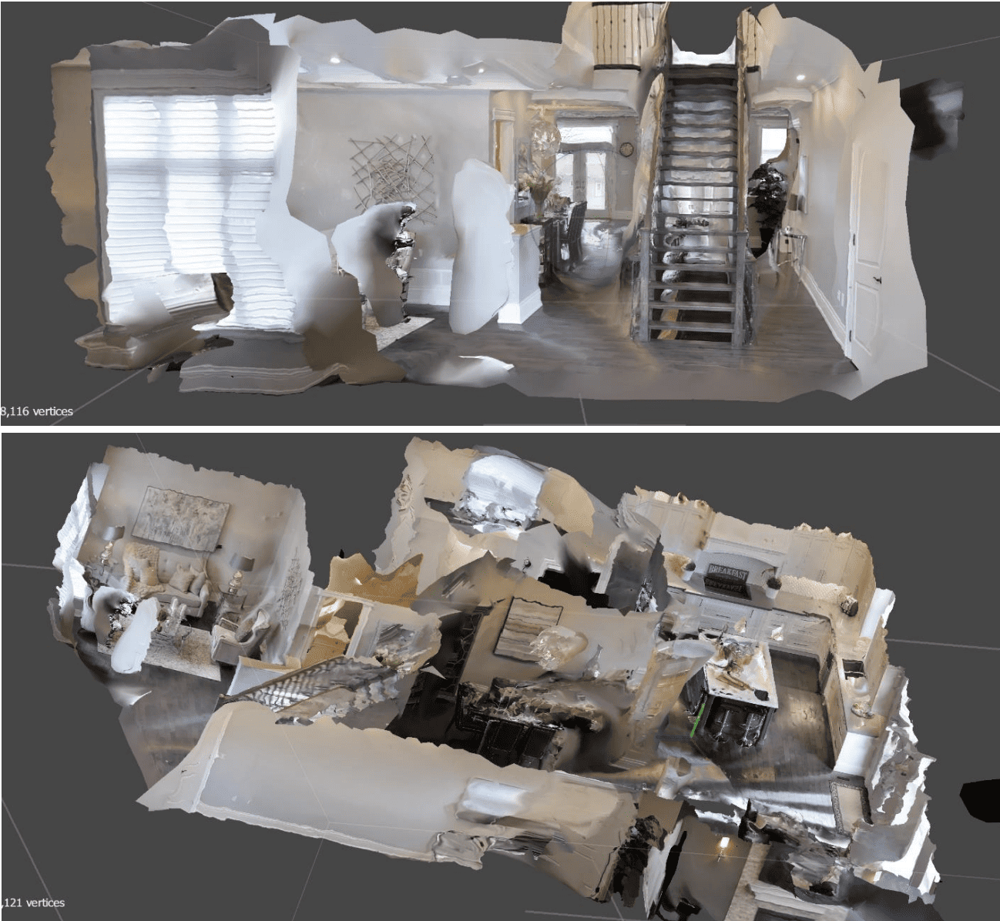
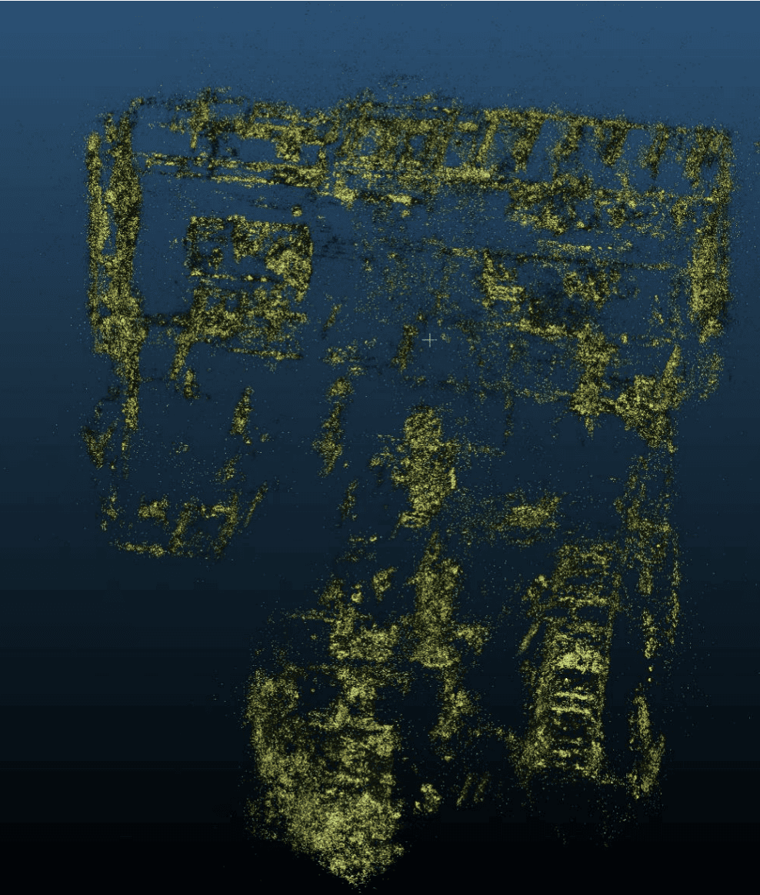

# Indoor Video → 3D Reconstruction

This repository showcases an **initial investigation** into methods for converting **building walkthrough videos** into **3D models**. The goal is to build upon the approach presented in:

> *Architectural experience: Clarifying its central components and their relation to core affect with a set of first‑person‑view videos*\
> [Read the paper](https://www.sciencedirect.com/science/article/pii/S027249442200086X)

by extracting additional spatial information from video datasets. The focus is on three methods:

1. **Photogrammetry** ([Agisoft Metashape](https://www.agisoft.com/))
2. **NeRF (Neural Radiance Fields)** ([Nerfstudio]())
3. **3D Gaussian Splatting** ([gaussian-splatting](https://github.com/graphdeco-inria/gaussian-splatting); [GS Unity viewer](https://github.com/aras-p/UnityGaussianSplatting))

> **Note:** This repo contains **only instructions and demonstration media** (screenshots and screen recordings). No 3D models are provided.

---

## Video Dataset

- **Dataset page:** [https://osf.io/kbdvg/files](https://osf.io/kbdvg/files)
- **Selected video:** [High‑resolution indoor walkthrough](https://osf.io/mdqek?view_only=7001f5a0d12b444f8e3586c5aa897ccc) — chosen for consistent object visibility across frames.

---

## 1) Frame Extraction

Create environment:

```bash
conda create --name construct3D -y python=3.8
conda activate construct3D
conda install pip -y
pip install "numpy<1.25" opencv-python
```

Script (`video_to_frames.py`):

```python
import cv2, os
video_path = "input_video.mp4"
output_folder = "frames"
os.makedirs(output_folder, exist_ok=True)
frame_interval = 5
cap = cv2.VideoCapture(video_path)
frame_count = saved_count = 0
while cap.isOpened():
    ret, frame = cap.read()
    if not ret:
        break
    if frame_count % frame_interval == 0:
        cv2.imwrite(os.path.join(output_folder, f"frame_{saved_count:04d}.jpg"), frame)
        saved_count += 1
    frame_count += 1
cap.release()
print(f"Extracted {saved_count} frames to '{output_folder}'")
```

**Tips:** Keep \~2–5 FPS equivalent coverage; remove blurry/rapid‑turn frames; favor textured areas over blank walls.

---

## 2) Photogrammetry (Agisoft Metashape)

**This method follows** the standard Agisoft Metashape workflow: [https://www.agisoft.com/](https://www.agisoft.com/)

Workflow summary:

- Add Photos → load frames
- Align Photos: High/Medium accuracy; Sequential preselection; Key=40k, Tie=4k
- Clean & Optimize: Tools → Tie Points → Gradual Selection (RU>10–15, PA>3–4, RE>0.3–0.5) → Optimize Cameras (f, cx, cy, k1–k4, p1, p2)
- Build Depth Maps: High/Medium quality; Mild/Moderate filtering
- Build Mesh: From Depth Maps; Arbitrary surface; Interpolation enabled
- Build Texture: Generic mapping; Mosaic blending (e.g., 1×8192)
- Scale & Orient: Add scale bar(s) using a known distance; level the model

**Demo:**&#x20;



[Metashape 3D Model Snap Video](Demos/metashape_3D_model_video_snap.mp4)


---

## 3) NeRF (Nerfstudio)

**This method follows** Nerfstudio: [https://docs.nerf.studio/](https://docs.nerf.studio/)

**Prerequisites (Windows/NVIDIA):**

- Visual Studio **2019** with *Desktop development with C++* (for native builds)
- NVIDIA GPU with drivers matching **CUDA 11.8**

Install:

```bash
# PyTorch with CUDA 11.8
pip install torch==2.1.2+cu118 torchvision==0.16.2+cu118 --extra-index-url https://download.pytorch.org/whl/cu118

# FFmpeg and helper
conda install -c conda-forge ffmpeg -y
pip install "pywinpty==2.0.13"

# Nerfstudio
pip install nerfstudio

# tiny-cuda-nn (optional acceleration)
pip install git+https://github.com/NVlabs/tiny-cuda-nn/#subdirectory=bindings/torch

# (Optional) CUDA toolkit via conda
conda install -c "nvidia/label/cuda-11.8.0" cuda-toolkit -y
```

Export camera poses from Metashape (XML) and process:

```bash
ns-process-data metashape --data {images_dir} --xml {camera_poses.xml} --output-dir {PROCESSED_DATA_DIR}
ns-train nerfacto --data {PROCESSED_DATA_DIR}
```

Open the web viewer URL printed at the end of training to inspect and export point clouds/meshes or render fly‑throughs.

**Demo:** [NeRF Rendered Video](Demos/NeRF_renderedVideo_snap.mp4)


---

## 4) 3D Gaussian Splatting

**This method follows** the graphdeco‑inria implementation: [https://github.com/graphdeco-inria/gaussian-splatting](https://github.com/graphdeco-inria/gaussian-splatting)

Setup:

```bash
git clone https://github.com/graphdeco-inria/gaussian-splatting --recursive
cd gaussian-splatting
SET DISTUTILS_USE_SDK=1
conda env create --file environment.yml
conda activate gaussian_splatting
```

Train (example):

```bash
# Using a prepared dataset (e.g., COLMAP-format or your processed data directory)
python train.py -s {PROCESSED_DATA_DIR}
```

**Interactive Unity viewing** follows: [https://github.com/aras-p/UnityGaussianSplatting](https://github.com/aras-p/UnityGaussianSplatting)

**Demo:**

[Point Cloud output](Demos/guassianSplatting_pointCloud_snap.png)



[Gaussian Splatting Unity Output](Demos/GaussianSplatting_UnityOutput_snap.mp4)


---

## Notes & Limitations

- Short, fast‑motion video reconstruction quality.
- Photogrammetry produces metric meshes; NeRF/GS excel at view synthesis.
- Workflow can be applied to other datasets for method comparison.
- Even partial point clouds can support interior classification, boundary extraction, and isovist analysis.

---

## References

- [OSF Dataset](https://osf.io/kbdvg/files)
- [Architectural Experience Paper](https://www.sciencedirect.com/science/article/pii/S027249442200086X)
- [Agisoft Metashape](https://www.agisoft.com/)
- [Nerfstudio](https://docs.nerf.studio/)
- [3D Gaussian Splatting](https://github.com/graphdeco-inria/gaussian-splatting)
- [Unity Gaussian Splatting Viewer](https://github.com/aras-p/UnityGaussianSplatting)

